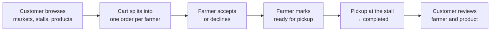
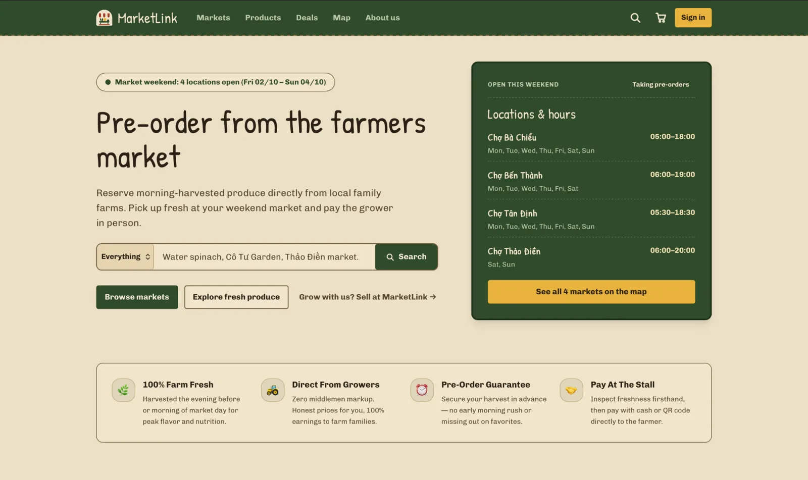
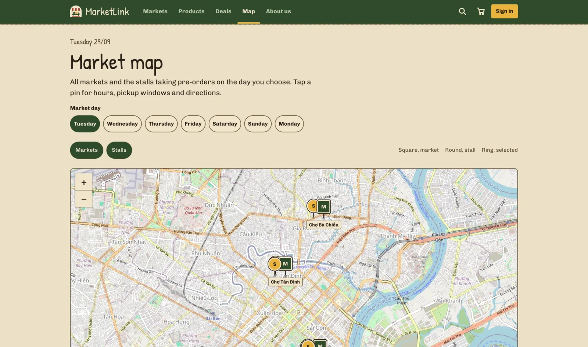
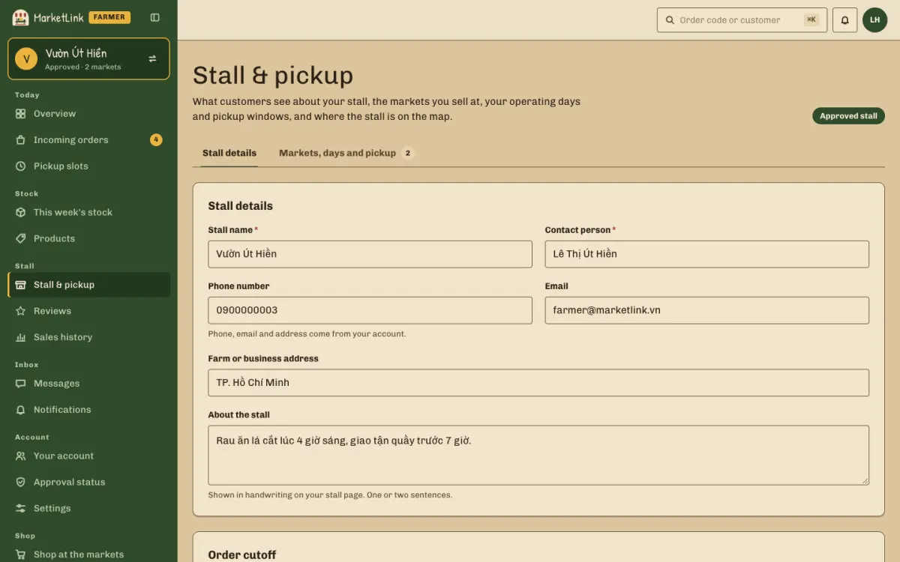
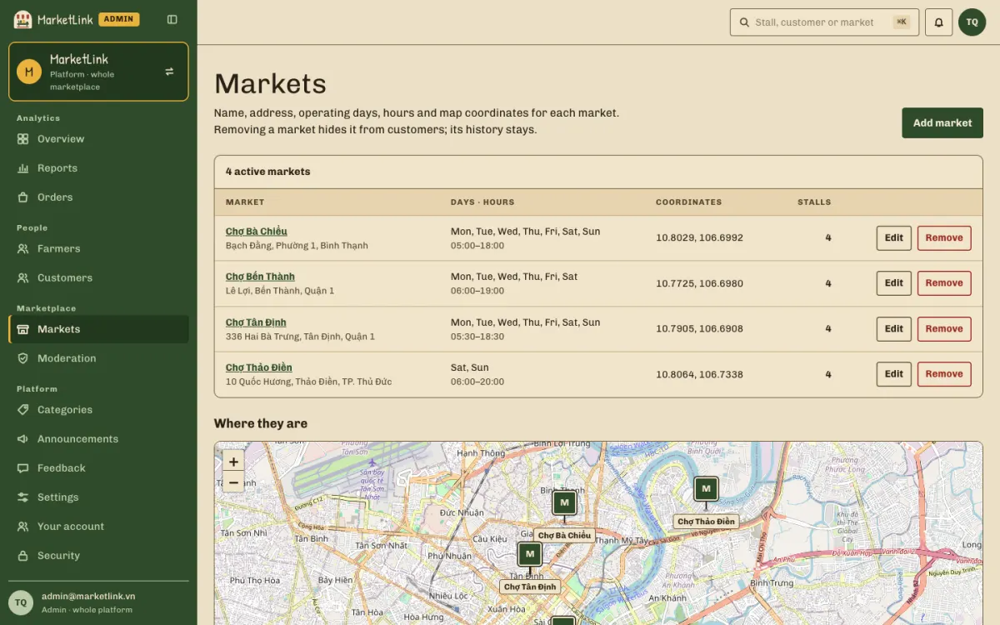
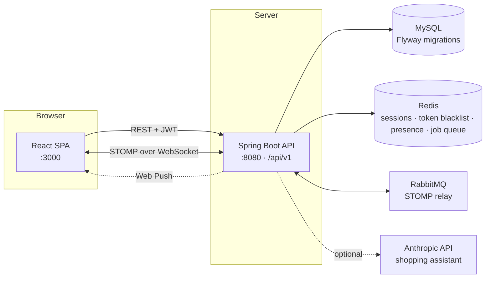

<div align="center">


# MarketLink

**Pre-order fresh produce from the farmers at Ho Chi Minh City's weekend markets, then pick it up at their stall.**

TechWiz 7 · End-to-End Web Solutions · theme *eGreen Basket*

[](https://github.com/hoangtuanqn/market-link/actions/workflows/ci.yml)


[Quick start](#quick-start) · [Features](#features) · [Architecture](#architecture) ·
[Documentation](docs/README.md) · [Contributing](CONTRIBUTING.md)

</div>

---

## About

Farmers' markets sell out early, and shoppers only find out what a stall has once they get there. MarketLink puts
every market, stall and product online: a customer reserves produce ahead of time, the farmer accepts the order, and
the customer collects it in a chosen pickup slot. Farmers know their demand before market day; customers never
make a wasted trip.



Stock is reserved the moment an order is placed, and the customer can edit or cancel until the farmer's cutoff time.
Every rule behind the order flow is written down in [`docs/decisions.md`](docs/decisions.md) (D-01…D-13).

## Features

| Customer | Farmer | Admin |
|---|---|---|
| Browse markets by location and day, on a list or an interactive map with directions | Stall profile: markets, operating days, pickup windows, map pin | Separate admin sign-in, optional two-factor authentication |
| Search and filter products by category, price, market and day | Products with photos, sold-out / paused flags | Dashboard: farmers, customers, markets, orders |
| Cart that splits into one order per farmer, with a pickup date and time slot | Weekly stock template, applied per market day | Approve, reject or suspend farmer applications |
| Edit or cancel before the cutoff, reorder in one click | Incoming orders: accept, decline, ready, complete | Markets (with map coordinates, closures) and categories |
| Favourites with restock alerts, in-app and Web Push notifications | Order cutoff and pickup-slot capacity | Moderate products, reviews and reported chat messages |
| Reviews and ratings for farmers and products | Dashboard: total and pending orders, revenue, best sellers | Platform reports: revenue per market, most active farmers |
| Chat with a stall; a shopping assistant that Claude answers for signed-in users | Reply to reviews, chat with customers | Customer accounts, feedback queue, platform announcements |

Across the app: 10 UI languages, light and dark themes, responsive from 375 px to 1440 px, and a loading / empty /
error state on every data screen. The full scope, one `FR-xxx` ID per requirement, is in
[`.ai/REQUIREMENTS.md`](.ai/REQUIREMENTS.md).

## Screenshots

| Home — markets open this weekend | Market map — markets and stalls by day |
|---|---|
|  |  |
| **Farmer — stall, markets and pickup windows** | **Admin — markets with hours and coordinates** |
|  |  |

## Tech stack

| Layer | Technology |
|---|---|
| Frontend | React 19, TypeScript, Vite, Tailwind CSS 4, React Router, i18next, Leaflet + OpenStreetMap, STOMP.js |
| Backend | Spring Boot 4.1 on Java 25: Spring Security with JWT, Spring Data JPA, WebSocket (STOMP), Bean Validation, springdoc OpenAPI |
| Data | MySQL 8.4 with Flyway migrations, Redis 7.4 |
| Messaging | RabbitMQ 4 as the STOMP relay for realtime chat and notifications, Web Push (VAPID) |
| AI assistant | Claude (`claude-haiku-4-5`) through the Anthropic API, calling read-only tools that run fixed, parameterised SQL; a keyword engine answers when no key is set |
| Quality | JUnit + Mockito, Vitest + Testing Library, ESLint, Prettier, Spotless, Lefthook pre-commit hooks |
| Delivery | Docker Compose for dev and production, GitHub Actions for CI and branch guards |

## Architecture



- The backend is split into feature modules (`user`, `farmer`, `catalog`, `product`, `stall`, `order`, `review`,
  `favorite`, `notification`, `conversation`, `chat`, `report`, `feedback`, `achievement`), each with its own
  controllers, services, requests, resources and exception handler. Conventions: [`backend/CLAUDE.md`](backend/CLAUDE.md).
- The frontend is one page folder per screen under `src/pages/<role>/`, shared UI in `src/components/`, and API calls
  in `src/api-requests/`. Every screen follows the "Hang tag" design system in [`docs/design-system/`](docs/design-system/README.md).
- The API contract between the two is [`docs/api-contract.md`](docs/api-contract.md); Swagger UI runs at
  http://localhost:8080/swagger-ui.html while the backend is up.

## Quick start

You need **Docker Desktop** and **make** (on Windows, run `make` from WSL or Git Bash).

```bash
git clone https://github.com/hoangtuanqn/market-link.git
cd market-link
make up      # MySQL, Redis, RabbitMQ, backend :8080, frontend :3000 — first build takes a few minutes
make seed    # demo data: 4 markets, 10 stalls, 51 products, orders in every status
```

Six months of history for the dashboards and reports (100+ customers, 500+ orders) is optional — see
[`db/README.md`](db/README.md). To let Claude answer the shopping assistant, put an `ANTHROPIC_API_KEY` in `.env`
and run `make up` again ([`docs/setup.md`](docs/setup.md#6-shopping-assistant-answered-by-claude)).

Open **http://localhost:3000** and sign in with a demo account (password `Demo@1234` for all):

| Role | Email | Sign in at |
|---|---|---|
| Customer | `customer@marketlink.vn` | http://localhost:3000/login |
| Farmer | `farmer@marketlink.vn` | http://localhost:3000/login |
| Admin | `admin@marketlink.vn` | http://localhost:3000/admin/login |

Every seeded account and what it shows: [`docs/DEMO_CREDENTIALS.md`](docs/DEMO_CREDENTIALS.md). To run the backend
or frontend outside Docker, enable Web Push, or fix a failing start: [`docs/setup.md`](docs/setup.md).

```bash
make help      # every command
make be-test   # backend tests
make lint      # ESLint + Spotless check
make down      # stop, keep data
```

## Project structure

```
market-link/
├── backend/                 Spring Boot API (Java 25) — src/main/java/.../modules/<module>/
├── frontend/                React SPA — src/pages/<role>/<Page>/, src/components/, src/locales/<lang>/
├── db/                      schema.sql (design), schema dump (live tables), seed.sql, seed-extended.sql, seed-images/
├── docs/                    requirements, API contract, decisions, design system, prototype, setup guide
├── docker/                  Dockerfiles for the backend and frontend images
├── scripts/                 git and environment guards used by the hooks and CI, the demo-history generator
├── .ai/REQUIREMENTS.md      scope: every requirement with its FR-xxx ID, priority and owner
├── .github/                 CI (format, lint, test, build), branch-policy guard, PR template
├── docker-compose.yml       dev stack (make up)
├── docker-compose.prod.yml  production overrides (make prod)
└── Makefile                 day-to-day commands (make help)
```

## Documentation

| Document | What it covers |
|---|---|
| [`docs/README.md`](docs/README.md) | Index of every document in `docs/` |
| [`docs/requirements/`](docs/requirements) | The SRS, and how each SRS item maps to an FR and a screen |
| [`docs/decisions.md`](docs/decisions.md) | Product decisions that shape the order flow (D-01…D-13) |
| [`docs/api-contract.md`](docs/api-contract.md) | Every endpoint: path, request, response, errors |
| [`docs/design-system/`](docs/design-system/README.md) | Tokens, `ml-*` components and UI copy rules |
| [`docs/prototype/`](docs/prototype) | Clickable HTML prototype of every screen |
| [`docs/setup.md`](docs/setup.md) | Full setup, both ways of running, troubleshooting |
| [`CONTRIBUTING.md`](CONTRIBUTING.md) | Branches (`dev` → `main`), commits, pull requests, releases |

## AI tools used

The team used **Claude Code** (Anthropic) as a coding assistant throughout the project — for scaffolding
new features, refactoring, code review, and drafting documentation such as this README and the files in
`docs/`. All AI-generated code was reviewed, tested and adapted by the team before merging; no part of the
codebase was accepted unreviewed. No ready-made website template was used — the UI is built from the
project's own design system (`docs/design-system/`). Image assets are placeholders or the team's own
photos; no AI image-generation tool was used for shipped assets.

## Contributing

Work happens on `feature/*`, `fix/*`, `docs/*`, `chore/*` or `refactor/*` branches cut from `dev`; `main` only takes
releases from `dev`. Commits follow `<type>(FR-xxx): <description>`, CI must be green, and every pull request needs a
review. The full rules are in [`CONTRIBUTING.md`](CONTRIBUTING.md); AI assistants also read [`CLAUDE.md`](CLAUDE.md)
and [`AGENTS.md`](AGENTS.md).
