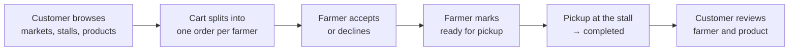
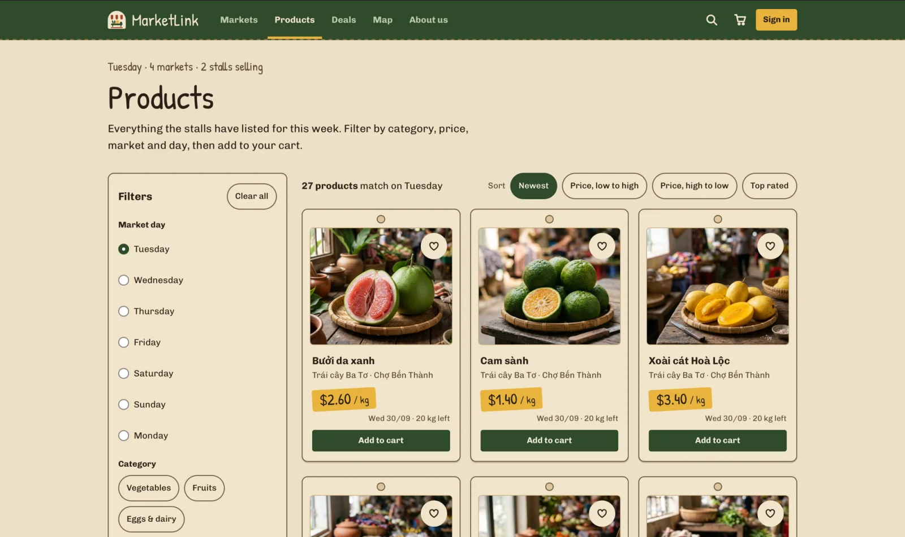
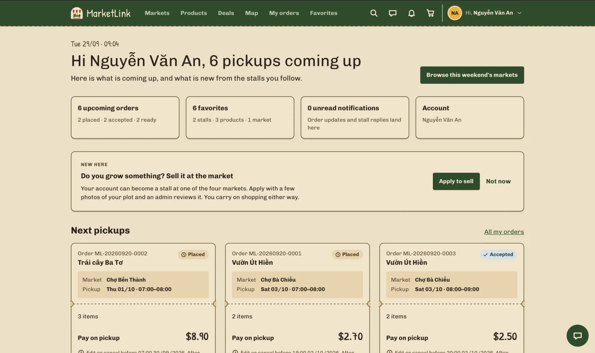
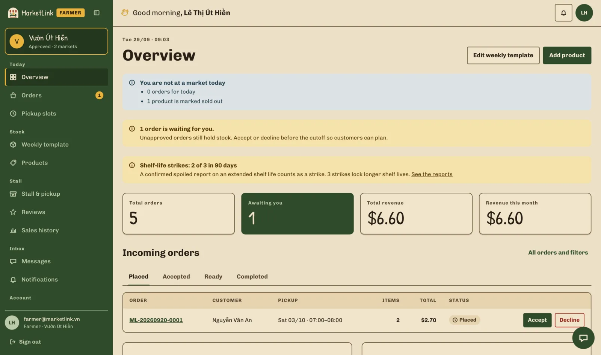
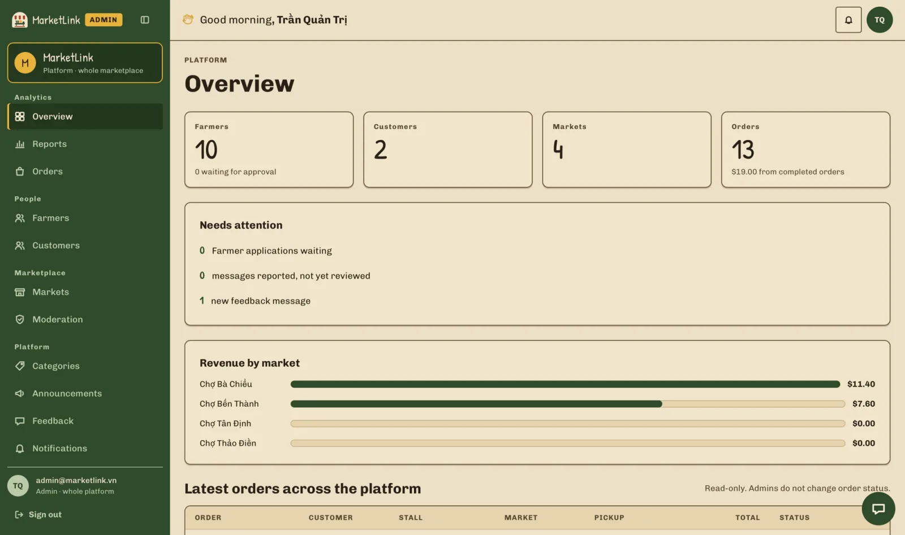
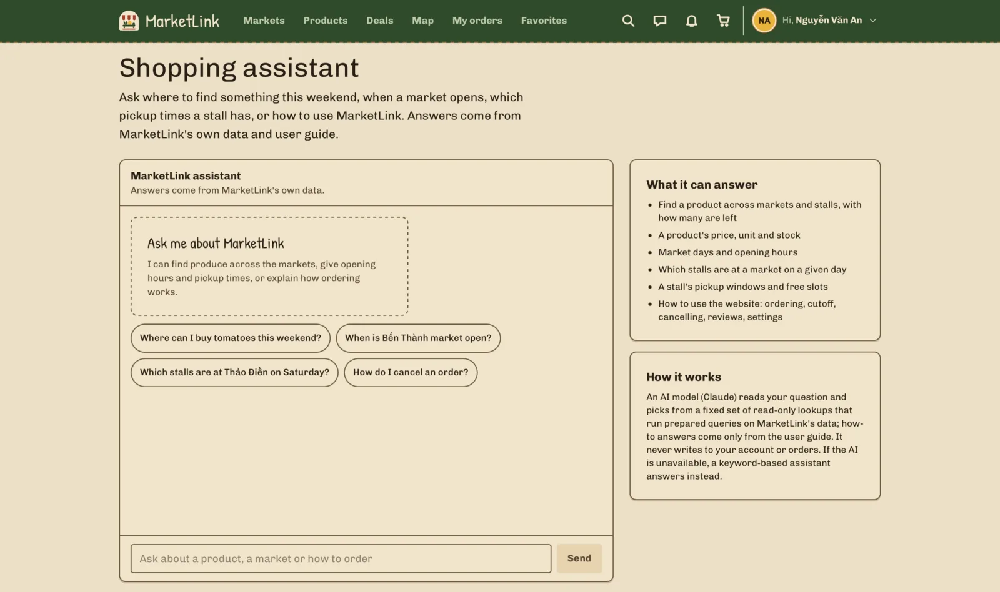
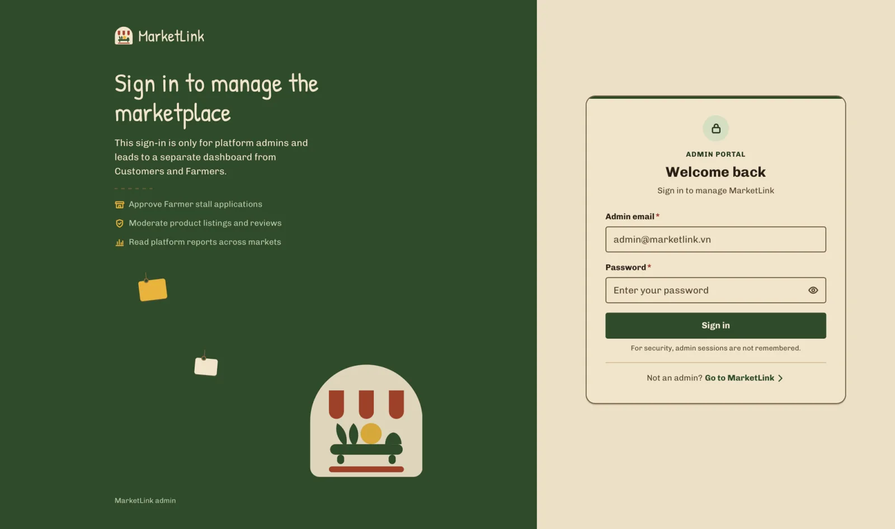
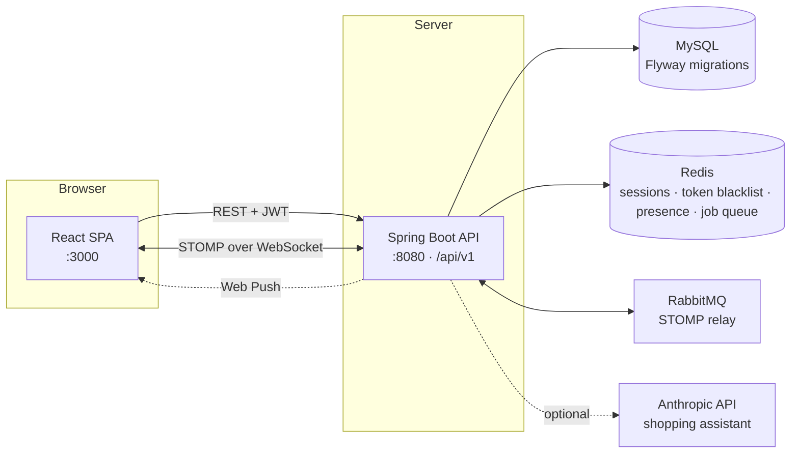
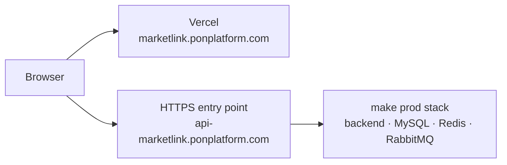

<div align="center">


# MarketLink

**Pre-order fresh produce from the farmers at Ho Chi Minh City's weekend markets, then pick it up at their stall.**

TechWiz 7 · End-to-End Web Solutions · theme *eGreen Basket*

[](https://github.com/hoangtuanqn/market-link/actions/workflows/ci.yml)


### 🌿 [**Live demo → marketlink.ponplatform.com**](https://marketlink.ponplatform.com/)

[Live demo](#live-demo) · [Screenshots](#screenshots) · [Features](#features) · [Architecture](#architecture) ·
[Quick start](#quick-start) · [Deployment](#deployment) · [Documentation](docs/README.md) ·
[Contributing](CONTRIBUTING.md)

</div>

---

## About

Farmers' markets sell out early, and shoppers only find out what a stall has once they get there. MarketLink puts
every market, stall and product online: a customer reserves produce ahead of time, the farmer accepts the order, and
the customer collects it in a chosen pickup slot. Farmers know their demand before market day; customers never
make a wasted trip. Nothing is paid online — money changes hands at the stall, the way these markets already work.



Stock is reserved the moment an order is placed, and the customer can edit or cancel until the farmer's cutoff time.
Every rule behind the order flow is written down in [`docs/decisions.md`](docs/decisions.md) (D-01…D-14).

## Live demo

| | |
|---|---|
| **Web app** | **https://marketlink.ponplatform.com** |
| API | `https://api-marketlink.ponplatform.com/api/v1` |

The demo runs the seed data below — 4 markets, 10 stalls, 51 products, orders in every status. Password for every
account is `Demo@1234`.

| Role | Email | Sign in at | What it shows |
|---|---|---|---|
| Customer | `customer@marketlink.vn` | `/login` | Browsing, cart, orders, favourites, chat, assistant |
| Farmer | `farmer@marketlink.vn` | `/login` | Stall "Vườn Út Hiền": products, weekly stock, slots, incoming orders |
| Farmer (2nd) | `farmer2@marketlink.vn` | `/login` | Stall "Trái cây Ba Tơ" — a cart with both stalls splits into two orders (D-01) |
| Admin | `admin@marketlink.vn` | `/admin/login` | Approvals, markets, categories, moderation, reports |

> **Admin accounts must set up two-factor authentication on first sign-in** — a password alone is refused by the
> server, not merely hidden in the UI. Walkthrough: [`docs/DEMO_CREDENTIALS.md`](docs/DEMO_CREDENTIALS.md).

## Screenshots

| Home — what is open this weekend | Products — filter by day, category, price, market |
|---|---|
| [](docs/images/customer-home.webp) | [](docs/images/customer-products.webp) |
| **Market map — markets and stalls on the day you pick** | **Customer — upcoming pickups and favourites** |
| [](docs/images/customer-market-map.webp) | [](docs/images/customer-dashboard.webp) |
| **Farmer — orders waiting, revenue, shelf-life strikes** | **Admin — platform overview and revenue per market** |
| [](docs/images/farmer-dashboard.webp) | [](docs/images/admin-dashboard.webp) |
| **Shopping assistant — answers from MarketLink's own data** | **Admin portal — its own sign-in, sessions never remembered** |
| [](docs/images/customer-assistant.webp) | [](docs/images/admin-login.webp) |

## Features

| Customer | Farmer | Admin |
|---|---|---|
| Browse markets by location and day, on a list or an interactive map with directions | Stall profile: markets, operating days, pickup windows, map pin | Separate admin sign-in with mandatory two-factor authentication |
| Search and filter products by category, price, market and day | Products with photos, sold-out / paused flags, trash bin with restore | Dashboard: farmers, customers, markets, orders, revenue per market |
| Cart that splits into one order per farmer, with a pickup date and time slot | Weekly stock template applied per market day, plus per-date adjustments | Approve, reject or suspend farmer applications, with a duration and an audit trail |
| Edit or cancel before the cutoff, reorder in one click | Incoming orders: accept, decline, ready, complete | Markets (map coordinates, closures) and categories |
| Near-expiry deals: a cheaper price on the pickup day produce has to move | Post a deal per pickup date, with the batch's packing date and best-before | Moderate products, reviews and reported chat messages |
| Shelf-life promise and best-before shown on every order line | Suggested shelf life per storage group; going longer needs a signed promise | Spoilage reports queue; a confirmed report on an extended shelf life is a strike |
| Report spoiled produce on a completed order, with a photo | Three strikes in 90 days locks longer shelf lives | Customer accounts, feedback queue, platform announcements, maintenance mode |
| Favourites with restock alerts, in-app and Web Push notifications | Dashboard: pending orders, revenue, best sellers, stock left today | Platform reports: revenue per market, most active farmers |
| Reviews and ratings for farmers and products | Reply to reviews, chat with customers (photos and video) | Read-only on orders — admins never change an order's status |
| Chat with a stall; a shopping assistant Claude answers for signed-in users | | |

Across the app: **10 UI languages**, light and dark themes, responsive from 375 px to 1440 px, and a
loading / empty / error state on every data screen. The full scope, one `FR-xxx` ID per requirement, is in
[`.ai/REQUIREMENTS.md`](.ai/REQUIREMENTS.md).

## Tech stack

| Layer | Technology |
|---|---|
| Frontend | React 19, TypeScript, Vite, Tailwind CSS 4, React Router, i18next, Leaflet + OpenStreetMap, STOMP.js |
| Backend | Spring Boot 4.1 on Java 25: Spring Security with JWT, Spring Data JPA, WebSocket (STOMP), Bean Validation, springdoc OpenAPI |
| Data | MySQL 8.4 with 51 Flyway migrations, Redis 7.4 (sessions, token blacklist, presence, job queue, rate limits) |
| Messaging | RabbitMQ 4 as the STOMP relay for realtime chat and notifications, Web Push (VAPID) |
| AI assistant | Claude (`claude-haiku-4-5`) through the Anthropic API, calling read-only tools that run fixed, parameterised SQL; a keyword engine answers when no key is set |
| Quality | JUnit + Mockito, Vitest + Testing Library, ESLint, Prettier, Spotless, Lefthook pre-commit hooks |
| Delivery | Docker Compose for dev and production, Vercel for the deployed frontend, GitHub Actions for CI and branch guards |

## Architecture



- The backend is split into feature modules (`user`, `farmer`, `catalog`, `product`, `stall`, `order`, `quality`,
  `review`, `favorite`, `notification`, `conversation`, `chat`, `report`, `feedback`, `platform`, `geo`,
  `achievement`), each with its own controllers, services, requests, resources and exception handler. Conventions:
  [`backend/CLAUDE.md`](backend/CLAUDE.md).
- Authorisation is enforced on the server for every `:id` route — role **and** ownership, never a hidden button
  alone. An order moved out of sequence is a `409`, not a silent no-op (D-04).
- The frontend is one page folder per screen under `src/pages/<role>/`, shared UI in `src/components/`, and API calls
  in `src/api-requests/`. Every screen follows the "Hang tag" design system in
  [`docs/design-system/`](docs/design-system/README.md).
- The API contract between the two is [`docs/api-contract.md`](docs/api-contract.md): `/api/v1`, JSON in
  `camelCase`, database columns in `snake_case`. Swagger UI runs at http://localhost:8080/swagger-ui.html while the
  dev backend is up; it is switched off in production.

## Quick start

You need **Docker Desktop** and **make** (on Windows, run `make` from WSL or Git Bash).

```bash
git clone https://github.com/hoangtuanqn/market-link.git
cd market-link
make up      # MySQL, Redis, RabbitMQ, backend :8080, frontend :3000 — first build takes a few minutes
make seed    # demo data: 4 markets, 10 stalls, 51 products, 8 categories, orders in every status
```

Open **http://localhost:3000** and sign in with any account from the [live demo table](#live-demo) — the same seed
runs locally.

Six months of history for the dashboards and reports (100+ customers, 500+ orders) is optional — see
[`db/README.md`](db/README.md). To let Claude answer the shopping assistant, put an `ANTHROPIC_API_KEY` in `.env`
and run `make up` again ([`docs/setup.md`](docs/setup.md#6-shopping-assistant-answered-by-claude)). To run the
backend or frontend outside Docker, enable Web Push, or fix a failing start: [`docs/setup.md`](docs/setup.md).

```bash
make help      # every command
make be-test   # backend tests (JUnit, inside the container)
make lint      # ESLint + Spotless check
make format    # Prettier + Spotless apply
make logs s=backend
make down      # stop, keep data
```

## Deployment

Production runs from `main` as a separate Docker Compose project — its own containers, network and volumes, with
MySQL, Redis and RabbitMQ not exposed outside the network and every secret required up front (`make prod` refuses
to start while a `<...>` placeholder is left in `.env.production`).

```bash
make prod-init   # create .env.production from the template, then fill in every <...> value
make prod        # build and run the production stack (main branch or a release tag only)
make prod-seed   # once, after the backend is up: admin + demo accounts and photos
make prod-logs s=backend
```

`make prod-seed` exists because the admin seeder only runs in the `dev` and `local` profiles, so a fresh production
database would otherwise have no admin at all. Checklist, variables and troubleshooting:
[`docs/setup.md`](docs/setup.md).

The public demo is deployed as **frontend on Vercel** (SPA fallback and asset caching in
[`frontend/vercel.json`](frontend/vercel.json)) talking to the **API on its own subdomain over HTTPS**:



Two settings matter for that split: `CORS_ALLOWED_ORIGINS` must list the exact frontend origin, and the
`refresh_token` cookie is `SameSite=Strict`, so the frontend and the API have to stay on the same registrable
domain — otherwise browsers drop the cookie and everyone is signed out when the access token expires.

## Project structure

```
market-link/
├── backend/                 Spring Boot API (Java 25) — src/main/java/.../modules/<module>/
├── frontend/                React SPA — src/pages/<role>/<Page>/, src/components/, src/locales/<lang>/
├── db/                      schema.sql (design), schema dump (live tables), seed.sql, seed-extended.sql, seed-images/
├── docs/                    requirements, API contract, decisions, design system, prototype, setup guide
├── docker/                  Dockerfiles for the backend and frontend images
├── scripts/                 git and environment guards used by the hooks and CI, the demo-history generator
├── .ai/REQUIREMENTS.md      scope: every requirement with its FR-xxx ID, priority and owner
├── .github/                 CI (format, lint, test, build), branch-policy guard, PR template
├── docker-compose.yml       dev stack (make up)
├── docker-compose.prod.yml  production overrides (make prod)
└── Makefile                 day-to-day commands (make help)
```

## Quality

- **Tests**: JUnit + Mockito on the backend (service rules, repositories run against the real schema, jobs on a
  fixed clock), Vitest + Testing Library on the frontend. Both suites run in CI.
- **Definition of Done** — seven conditions before a requirement is ticked: runs on the Docker stack, matches the
  contract, role **and** ownership checked server-side, validation on both sides, all four UI states at
  375/768/1440 px, tests for the business rule with `make be-test` and `make lint` green, and seed data that
  demonstrates it. The list lives in [`CLAUDE.md`](CLAUDE.md).
- **Guards**: Lefthook formats and checks commit messages locally; GitHub Actions runs format, lint, test and
  build, plus a branch-policy guard that keeps `dev` and `main` from being mixed.

## Documentation

| Document | What it covers |
|---|---|
| [`docs/README.md`](docs/README.md) | Index of every document in `docs/` |
| [`docs/setup.md`](docs/setup.md) | Full setup, both ways of running, production, troubleshooting |
| [`docs/DEMO_CREDENTIALS.md`](docs/DEMO_CREDENTIALS.md) | Every demo account and what it is good for |
| [`.ai/REQUIREMENTS.md`](.ai/REQUIREMENTS.md) | Scope: every requirement as `FR-xxx`, with priority and owner |
| [`docs/requirements/`](docs/requirements) | The SRS, and how each SRS item maps to an FR and a screen |
| [`docs/decisions.md`](docs/decisions.md) | Product decisions that shape the order flow (D-01…D-14) |
| [`docs/api-contract.md`](docs/api-contract.md) | Every endpoint: path, request, response, errors |
| [`docs/design-system/`](docs/design-system/README.md) | Tokens, `ml-*` components and UI copy rules |
| [`docs/prototype/`](docs/prototype) | Clickable HTML prototype of every screen |
| [`docs/chatbot-design.md`](docs/chatbot-design.md) | How the assistant answers without ever letting the model write SQL |
| [`CONTRIBUTING.md`](CONTRIBUTING.md) | Branches (`dev` → `main`), commits, pull requests, releases |

## AI tools used

The team used **Claude Code** (Anthropic) as a coding assistant throughout the project — for scaffolding
new features, refactoring, code review, and drafting documentation such as this README and the files in
`docs/`. All AI-generated code was reviewed, tested and adapted by the team before merging; no part of the
codebase was accepted unreviewed. No ready-made website template was used — the UI is built from the
project's own design system (`docs/design-system/`). Image assets are placeholders or the team's own
photos; no AI image-generation tool was used for shipped assets.

## Contributing

Work happens on `feature/*`, `fix/*`, `docs/*`, `chore/*` or `refactor/*` branches cut from `dev`; `main` only takes
releases from `dev`. Commits follow `<type>(FR-xxx): <description>`, CI must be green, and every pull request needs a
review. The full rules are in [`CONTRIBUTING.md`](CONTRIBUTING.md); AI assistants also read [`CLAUDE.md`](CLAUDE.md)
and [`AGENTS.md`](AGENTS.md).
